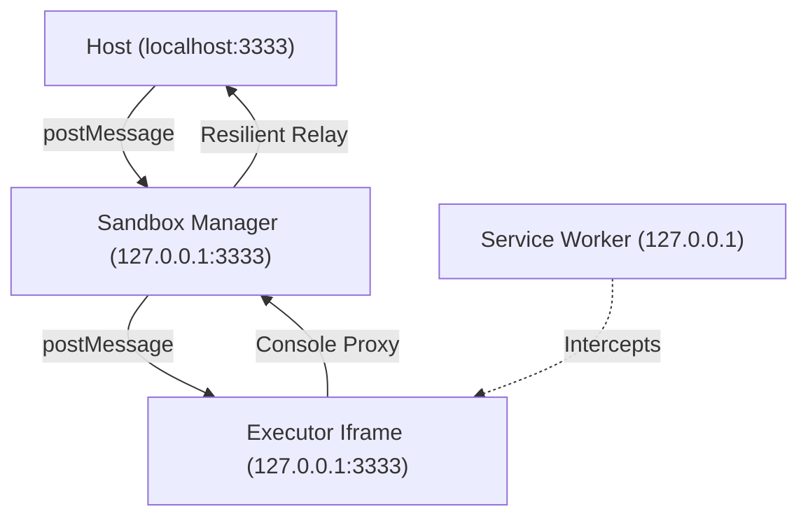

# iFrame Sandbox MRE

A production-pattern Minimum Reproducible Example (MRE) of a secure, isolated JavaScript sandbox using iFrame origin isolation and Service Worker network interception.

## Core Features
- **Origin Isolation**: Uses `localhost` vs `127.0.0.1` to create a strict security boundary.
- **Network Interception**: A Service Worker manages and intercepts all requests from the sandbox.
- **Resilient Logging**: Custom "Telemetry Extractor" prevents `DataCloneError` when relaying complex logs (like Errors or SW objects).
- **Offline Support**: Cache-first strategy for the sandbox environment.

## Architecture

## Getting Started
1. **Install Dependencies**: `bun install`
2. **Start Server**: `bun server.ts`
3. **Open Browser**: Navigate to [http://localhost:3333](http://localhost:3333)

## Implementation Details

### Two-Origin Strategy
Browsers treat `localhost` and `127.0.0.1` as distinct origins. This allows the sandbox to be "cross-origin" from the host while sharing the same server process. This is the simplest way to test Service Worker interception locally.

### Resilient Relay
To avoid `DataCloneError` when sending results via `postMessage`, we use a **Metadata Extractor**. It recursively converts non-cloneable browser objects (like `ServiceWorkerRegistration`, `DOM Nodes`, or `Error` objects) into plain JSON descriptors.

---

## Troubleshooting

### Clearing Stale Cache
If you make changes to the Service Worker (`sw.js`) or the sandbox logic and they don't seem to apply:

1. **Open DevTools**: Press `F12` or `Cmd+Option+I`.
2. **Go to Application Tab**: Select "Application" from the top menu.
3. **Storage Section**:
   - Click **"Storage"** on the left sidebar.
   - Click **"Clear site data"** (ensure "Unregister service workers" is checked).
4. **Origin Specifics**: Repeat this process for **BOTH** `http://localhost:3333` and `http://127.0.0.1:3333`.
5. **Hard Refresh**: Use `Cmd + Shift + R` (Mac) or `Ctrl + F5` (Windows) on the main Host page.

### SW Status "Disconnected"
If the status badge stays gray or red:
- Check if you are on `localhost:3333`. The sandbox won't register correctly if the origin isn't secure (Localhost/127.0.0.1 are considered secure by browsers).
- Ensure no other process is using port `3333`.