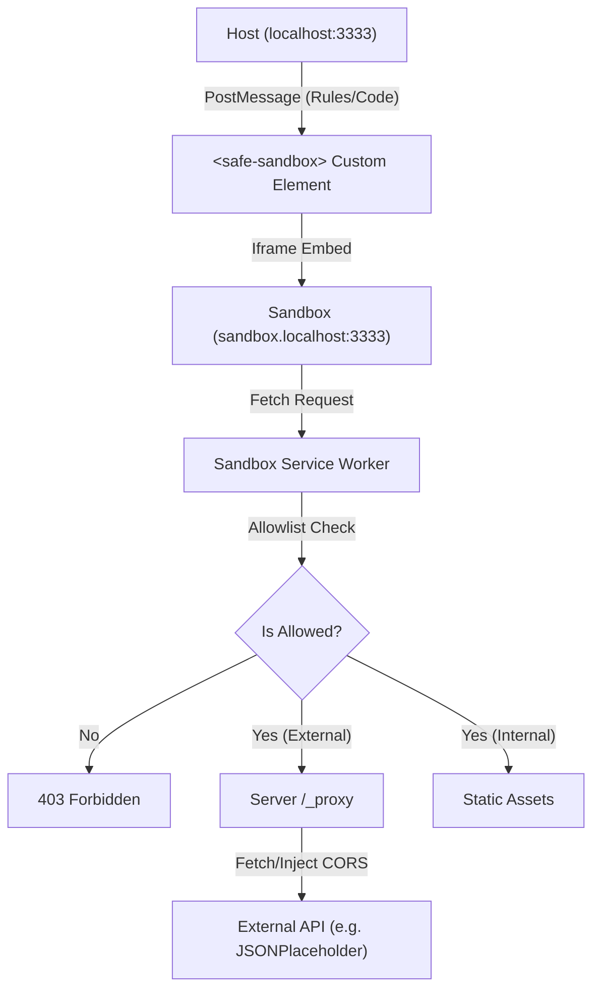

# SafeSandbox Library

A secure, non-intrusive JavaScript sandbox Custom Element featuring subdomain isolation, absolute network virtualization, and transparent CORS handling.

## Key Features

- **`<safe-sandbox>` Custom Element**: Easy integration into any web project.
- **Subdomain-based Isolation**: High-security barrier between Host (`localhost`) and Sandbox (`sandbox.localhost`).
- **Network Virtualization**: An allowlist-based firewall managed via Service Workers.
- **Static-First with Optional Proxy**: Transparent bypass for allowlisted external APIs via a server-side proxy. Works 100% statically for CORS-enabled APIs; requires a host-side handler (e.g., `/_proxy`) for non-CORS targets.
- **Ephemeral & Resilient**: Stateless Service Worker that automatically re-configs from the Host element upon reconnection.
- **In-Memory Virtual Files**: Inject mock data into the sandbox's filesystem without actual disk writes.

## Architecture



## Security Model

1.  **Origin Isolation**: The sandbox runs on a dedicated subdomain. Cookies and LocalStorage are not shared with the host.
2.  **Firewall-by-Default**: Every outgoing request from the sandbox is intercepted. Any request not in your `allow` list is blocked with a 403.
3.  **CSP Hardening**: The server enforces strict Content Security Policies that prevent malicious frames and restrict script execution sources.

## Future Work

- [ ] **WS Connections**: Implement    - [x] Update documentation for static-first approach <!-- id: 404 -->
    - [x] Refine Playground UI (JSON editor + Presets) <!-- id: 405 -->
    - [x] Fix UI log colors and enhance error hints <!-- id: 406 -->
Evaluate against `playground-elements` for developer experience.
- [ ] **Security Audits**: Automated CSP validation on startup.

## Service Worker Caching Strategies

The sandbox Service Worker supports three caching strategies for local assets (`executor.html`, `telemetry.js`), controlled via the `?strategy` URL parameter during registration:

1.  **`network-first` (Default)**: Best for safe development and reliable offline support. Tries the network first, falls back to cache if offline.
2.  **`network-only`**: Always and only gets the newest version from network, but doesn't work offline (PWA). UseUseful for debugging latest changes without any cache interference.
3.  **`cache-first`**: Uses cached assets instantly but **beware of stale code** during development.

**Usage:**
```javascript
// In client/index.html or your host app
navigator.serviceWorker.register("./sw.js?strategy=network-first");
```

> [!WARNING]
> **Stale Cache Trap**: If you use `cache-first` (or previously had a strong cache policy), you may see old versions of the sandbox even after deploying updates. If `sandbox/executor.html` changes, users effectively need a new Service Worker. The `network-first` default avoids this loop by always checking for updates.

## Testing

Run the included Playwright suite to verify isolation and network rules:
```bash
npx playwright test
```