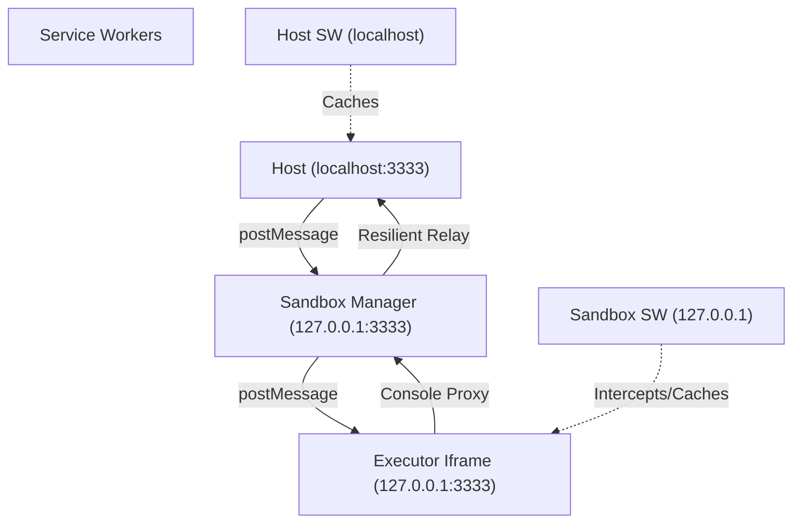

# iFrame Sandbox MRE

## Branch demonstrates how the host page can be local-first (without internet) by using a service worker - however a service worker on the host level should be application specific and not a generic sandbox service worker.

A production-pattern Minimum Reproducible Example (MRE) of a secure, isolated JavaScript sandbox using iFrame origin isolation and Service Worker network interception.

## Core Features
- **Origin Isolation**: Uses `localhost` vs `127.0.0.1` to create a strict security boundary.
- **Offline-First**: Dual Service Workers (Host & Sandbox) ensure the app works completely offline.
- **Network Interception**: A Service Worker manages and intercepts all requests from the sandbox (e.g., virtualizing files).
- **Resilient Logging**: Custom "Telemetry Extractor" prevents `DataCloneError` when relaying complex logs (like Errors or SW objects).
- **Security Headers**: Proper CSP headers configured for both Host and Sandbox (including `unsafe-eval` for code execution).

## Architecture

## Getting Started
1. **Install Dependencies**: `bun install`
2. **Start Server**: `bun server.ts`
3. **Open Browser**: Navigate to [http://localhost:3333](http://localhost:3333)

## Implementation Details

### Offline-First Strategy
The project uses two separate Service Workers:
- **Host SW**: Caches the UI and application shell.
- **Sandbox SW**: Caches the execution environment and virtualizes the network (intercepting `fetch()` calls).
Both workers use a cache-first strategy with automated cleanup of old versions on activation.

### Two-Origin Strategy
Browsers treat `localhost` and `127.0.0.1` as distinct origins. This allows the sandbox to be "cross-origin" from the host. This configuration allows testing complex cross-origin interactions and Service Worker interception locally.

### Resilient Relay
To avoid `DataCloneError` when sending results via `postMessage`, we use a **Metadata Extractor**. It recursively converts non-cloneable browser objects (like `ServiceWorkerRegistration`, `DOM Nodes`, or `Error` objects) into plain JSON descriptors.

---

## Troubleshooting

### Clearing Stale Cache
If changes to Service Workers or CSP headers don't seem to apply:

1. **Open DevTools**: Press `F12` or `Cmd+Option+I`.
2. **Application Tab**: 
   - Go to **"Storage"** -> **"Clear site data"** (ensure "Unregister service workers" is checked).
   - Do this for **BOTH** `localhost:3333` and `127.0.0.1:3333`.
3. **Hard Refresh**: Use `Cmd + Shift + R`.

### CSP EvalError
If you see an "EvalError", ensure the server is running the latest `server.ts` changes. The sandbox requires `script-src 'unsafe-eval'` to execute the string-based code you provide in the UI.

### SW Status "Disconnected"
- Check that you are on `localhost:3333` (not just opening the file directly).
- Ensure the server terminal shows `[Server] GET /sw.js -> /client/sw.js`.